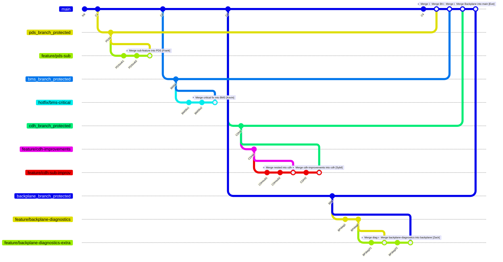

Let’s have a chat about Git branching in a way that feels like you’re just working with your code, rather than memorizing a list of commands. Imagine you have your repository history looking something like this:

```bash
* 82b7a92 (HEAD -> feature/my-feature) Add new code for feature
* 7ecf119 (origin/develop) Merge branch 'hotfix/typo-fix'
|\
| * 1e2a35d (hotfix/typo-fix) Fix a small typo in README
|/
* 1fc3210 (origin/master, master) Release v1.2
* 7a8df20 Add new docs
* 59c3b2a Initial commit
```

In this diagram, every commit is a snapshot—a save point—of your project. The branch names and labels like `(HEAD -> feature/my-feature)` tell you which branch you’re on. The protected branches (like our stable branches) are similar to the `master` branch here. But in our project, we have several stable branches: **main**, **pds_branch_protected**, **bms_branch_protected**, **cdh_branch_protected**, and **backplane_branch_protected**. These branches are your foundation; they’re the ones that should always contain code that compiles, passes tests, and works as expected. No one should be pushing experimental or untested changes directly into them.

When you’re working on something new, you create a feature branch off one of those stable branches. Let’s say you’re working on a new feature for the CDH system—you might create a branch called `feature/my-feature` from `cdh_branch_protected`. Here’s how you’d generally get going:

1. First, keep your local copy of the repository up to date. You’d do:
   ```bash
   git fetch
   git pull
   ```
   This pulls in the latest changes from GitHub so that your base (for example, `cdh_branch_protected`) is current.

2. Next, switch to your feature branch or create it if it doesn’t exist yet:
   ```bash
   git checkout -b feature/my-feature
   ```
   or with the newer command:
   ```bash
   git switch -c feature/my-feature
   ```

3. As you work, treat each commit like a save point. Regularly run:
   ```bash
   git status
   git add .
   git commit -m "A clear message about what changed"
   ```
   This way, if something breaks, you’ve got a checkpoint to return to.

4. When you’re ready to share your changes, push your branch to GitHub:
   ```bash
   git push origin feature/my-feature
   ```
   After that, you’ll open a pull request to merge your feature branch into the protected branch (like `cdh_branch_protected`). The idea is that the code in these stable branches should always work, because every pull request goes through automated compile checks and tests.

Now, about merging versus rebasing:  
- **Merging** brings the changes from one branch into another with a merge commit. It shows the true history with branches converging. For example:
  ```bash
  git checkout feature/my-feature
  git merge cdh_branch_protected
  ```
  This creates a commit that ties your changes and the latest stable code together.

- **Rebasing** is like taking your feature’s commits and “replaying” them on top of the current tip of the stable branch. It makes the history linear. You’d do:
  ```bash
  git checkout feature/my-feature
  git rebase cdh_branch_protected
  ```
  It’s a neat way to keep things tidy, but be careful: it rewrites history, so if your branch is shared, it can cause trouble.

One last important point: when you push changes after a rebase, you might be tempted to use `--force`, but always use:
```bash
git push --force-with-lease
```
This option protects you by refusing to overwrite changes on the remote if someone else has pushed updates, whereas a plain `--force` could inadvertently erase work.

In summary, your stable branches (main, pds_branch_protected, bms_branch_protected, cdh_branch_protected, backplane_branch_protected) are like the safe vaults that only get updated through thorough review and testing via pull requests. Meanwhile, your feature branches let you experiment and commit your work in small, frequent steps—your “save points.” Once your work is polished and merged, the history might look like the diagram above, showing a clear record of merges, fixes, and incremental improvements. Happy coding!


