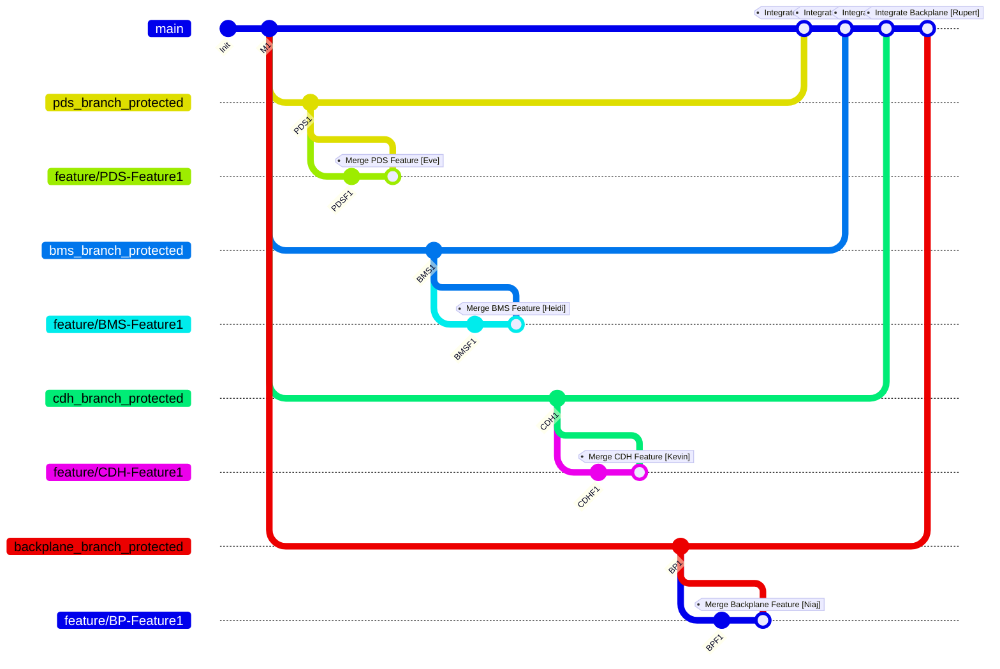

How This Branching Strategy Works
**Main Branch (Stable Base):**
The main branch serves as your production-ready, stable base. All releases are tagged here (e.g. “Main release (main) [Bob]”). No direct development happens on main—only thoroughly tested code is merged into it.

**Protected Subsystem Branches:**
Each subsystem—PDS, BMS, CDH, and Backplane—has its own protected branch (pds_branch_protected, bms_branch_protected, cdh_branch_protected, backplane_branch_protected). These branches are dedicated to their respective modules and are only updated via pull requests that include compile checks and tests. This keeps the code for each subsystem stable.

**Feature Branches:**
When a developer needs to implement a new feature (e.g. new sensor integration for PDS or a refactor for CDH), they create a feature branch off the appropriate protected branch. Once the feature is complete and fully tested, the branch is merged back into its protected branch. This process helps isolate development work from the stable code.

**Integration into Main:**
Periodically, the protected branches are merged back into main. This step integrates all the subsystem changes into a single, stable release candidate. Because the protected branches only contain working code, the main branch remains reliable.

This model (inspired by the nvie branching model) helps maintain a clear separation between development and production code. It allows teams to work concurrently on different subsystems while ensuring that only quality, tested code makes it into your production release. Happy branching!
