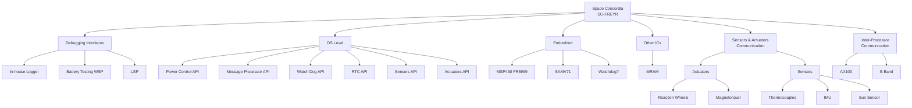

<!-- Top Images: Three identical images -->

  
  
  

<!-- Two-Column Header with Icon and Title -->
<table>
  <tr>
    <td style="vertical-align: middle; padding-right: 10px;">
      
    </td>
    <td style="vertical-align: middle;">
      <h1 style="margin: 0;">CDH Software System</h1>
      

        CDH Software System is the core of our spacecraft’s command and data handling architecture. It is organized into three primary layers that handle embedded hardware operations, system-level APIs, and user-facing debugging interfaces.
      

    </td>
  </tr>
</table>

---

## Table of Contents

- [Overview](#overview)
- [Components Involved](#components-involved)
  - [Embedded Systems](#embedded-systems)
  - [OS Level](#os-level)
  - [Debugging Interfaces](#debugging-interfaces)
- [Communication Protocols](#communication-protocols)
- [Task Decomposition and Assignment](#task-decomposition-and-assignment)
- [Software Guidelines](#software-guidelines)
- [Appendix](#appendix)
- [Component List](#component-list)
- [License](#license)

---

## Overview

The CDH Software System manages all aspects of our spacecraft’s command and data handling. The project is structured into three distinct layers:

1. **Embedded:** Directly manages hardware components such as microcontrollers and peripheral interfaces.
2. **OS Level:** Provides a set of APIs that build on the lower-level drivers to deliver system-level services.
3. **Debugging Interfaces:** Comprises web-based UIs and logging tools to generate test reports and facilitate diagnostics.

Our branching strategy follows the principles outlined in the [Successful Git Branching Model](https://nvie.com/posts/a-successful-git-branching-model/).

---

## Components Involved

Currently working on:

**The various software components are listed below:**

**IRQs are raised to request fetching updates from each board. Here is an interface diagram.**

  

---

## Task Decomposition and Assignment

## Software Guidelines

Our development adheres to NASA's Rule of Ten. For more details, please refer to the [NASA Rule of Ten](https://web.eecs.umich.edu/~imarkov/10rules.pdf).

---

## Appendix

### Helpful Resources

- [How to Create Software Design Documents (Lucidchart)](https://www.lucidchart.com/blog/how-to-create-software-design-documents)
- [Successful Git Branching Model](https://nvie.com/posts/a-successful-git-branching-model/)
- [Conventional Commits Specification](https://www.conventionalcommits.org/en/v1.0.0/)
- [Digital Jhelms' GitHub Gist](https://gist.github.com/digitaljhelms/4287848)

---

## Component List

*Note: Ensure that each component is assigned a unique ID and the list is maintained as the project evolves.*

| Component                | ID           | Description                                          |
| ------------------------ | ------------ | ---------------------------------------------------- |
| SAMV71 Microcontroller   | `SAMV71-001` | Primary processor for command distribution           |
| MSP430 Microcontroller   | `MSP430-001` | Secondary processor interfacing with peripherals     |
| MRAM Chip                | `MRAM-001`   | Non-volatile memory for data storage                 |
| Transceiver (AX100)      | `AX100-001`  | Facilitates communications in the Comms sub-module   |
| Imager Payload (Zetane)  | `ZETANE-001` | Captures and routes image data to the Comms sub-module |

---

## License

This project is licensed under the [MIT License](LICENSE).

---

Feel free to update the badges, URLs, and content as your project evolves.
