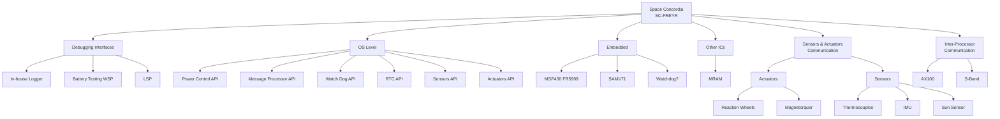

<!-- Top Images: Three identical images -->

  
  
  

<!-- Two-Column Header with Icon and Title -->
<table>
  <tr>
    <td style="vertical-align: middle; padding-right: 10px;">
      
    </td>
    <td style="vertical-align: middle;">
      <h1 style="margin: 0;">CDH Software System</h1>
      

        CDH Software System is the core of our spacecraft’s command and data handling architecture. It is organized into three primary layers that handle embedded hardware operations, system-level APIs, and user-facing debugging interfaces.
      

    </td>
  </tr>
</table>

---

## Table of Contents

- [Overview](#overview)
- [Components Involved](#components-involved)
- [Software Guidelines](#software-guidelines)
- [Appendix](#appendix)
- [License](#license)

---

## Overview

The CDH Software System manages all aspects of our spacecraft’s command and data handling. The project is structured into three distinct layers:

1. **Embedded:** Directly manages hardware components such as microcontrollers and peripheral interfaces.
2. **OS Level:** Provides a set of APIs that build on the lower-level drivers to deliver system-level services.
3. **Debugging Interfaces:** Comprises web-based UIs and logging tools to generate test reports and facilitate diagnostics.

---

## Components Involved

Currently working on:

**The various software components are listed below:**

## Contribution Guide

Before you begin: 
Check out the Github essentials: [#Docs/Github_Essentials.md](https://github.com/scsd-cdh/OBC/blob/d00afaf845758b6a269e30d44f57f17d18876272/Docs/Github_Essentials.md)

Your should be assigned an issue, 
You can go check it's requirements listed and start implementing it. Make sure you write good commit's with good descriptions.
Then once you merge it into the stable branch we have an idea of what you did. 

This is how you're development flow should look like:
[#Docs/branching_rules.md](https://github.com/scsd-cdh/OBC/blob/7fbe7e40980c13327b7881f3bf36f775a66de1ec/Docs/branching_rules.md)

The following document lists all the protocols required inter-MCU communication: [Protocols](https://docs.google.com/document/d/1QJ-23KT9wzDGa4bX3uof-pEGOELUUwvdz8o87ZT44fY/edit?tab=t.0)  -> Feel free to add required protocols whenever you want. Leave a comment for every change made. 

**MSP430 Project Setup and Structure**
[MSP Structure](https://github.com/scsd-cdh/OBC/blob/045e9a8daf7846750b0903a72c4fdc19a29c6233/DEV_GUIDE.md)

**SAMV71 Project Setup and Structure**
[Coming Soon](https://www.youtube.com/shorts/4neZwq696J4)
## Software Guidelines

Our development adheres to NASA's Rule of Ten. For more details, please refer to the 
- For C, [NASA Rule of Ten](https://web.eecs.umich.edu/~imarkov/10rules.pdf).
- Branching, [Successful Git Branching Model](https://nvie.com/posts/a-successful-git-branching-model/)
- Commit Naming, [Conventional Commits Specification](https://www.conventionalcommits.org/en/v1.0.0/)

Branching strategy: 
[Successful Git Branching Model](https://nvie.com/posts/a-successful-git-branching-model/).

---

## Appendix

### Helpful Resources

- [How to Create Software Design Documents (Lucidchart)](https://www.lucidchart.com/blog/how-to-create-software-design-documents)
- [Digital Jhelms' GitHub Gist](https://gist.github.com/digitaljhelms/4287848)

---

## License

This project is licensed under the [MIT License](LICENSE).

---

